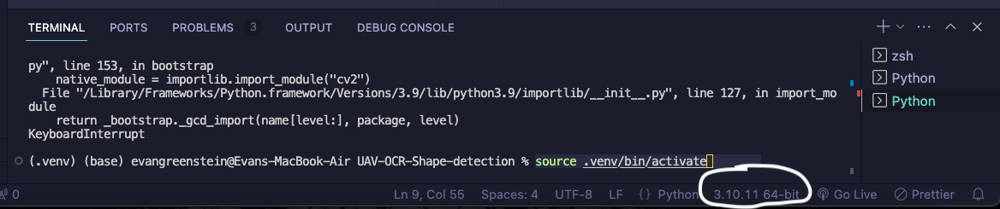
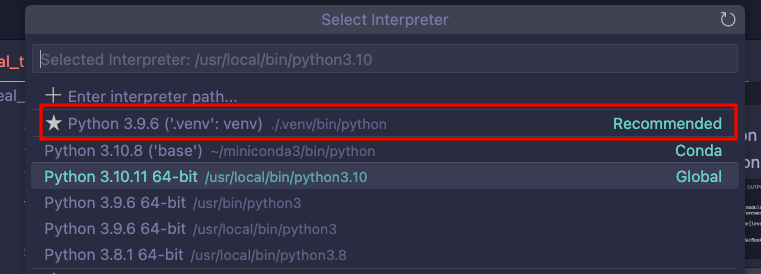

# UAV-OCR-Shape-detection

Image recognition program for UAV Concordia. Goal is to classify characters and shapes.

## Prequisites:

- Python is installed
- VS code is installed
- Python extension from microsoft installed in VS code
- pip (python package manager) is installed

## (WITH CUDA) Installation instructions on Jetson or Ubuntu WSL
If you're using Ubuntu WSL, also install cuda accelerate driver for WSL
https://dev.to/naruaika/using-opencv-on-windows-subsystem-for-linux-1ako
1. Install CUDA toolkit
2. Install CUDNN
3. Activate virutalenv
4. Install numpy
5. Download opencv & opencv_contrib
6. Rename both folders ```opencv``` & ```opencv_contrib```
7. Make build directory and cd into it
8. Run the following command to build opencv with CUDA configurations
```bash
 cmake -D CUDA_ARCH_BIN=7.5 -D WITH_CUDA=ON -D WITH_CUDNN=ON -D OPENCV_DNN_CUDA=ON -D ENABLE_FAST_MATH=1 -D CUDA_FAST_MATH=1 -D WITH_CUBLAS=1 -D OPENCV_ENABLE_NONFREE=ON -D OPENCV_EXTRA_MODULES_PATH=../opencv_contrib/modules/ -D PYTHON3_EXECUTABLE=$HOME/uav-test/.venv/ -D PYTHON3_NUMPY_INCLUDE_DIRS=$HOME/uav-test/.venv/lib64/python3.10/site-packages/numpy/core/include -D CMAKE_INSTALL_PREFIX=$HOME/uav-test/.venv ../opencv
```
8. run ```make -j4``` (jetson nano has 4 cpu cores only)
9. run ```sudo make install```
10. Hopefully should workd


## (No CUDA) Installation instructions on Mac OS

1. Install tesseract (pytesseract is just a wrapper, still needs the actual c++ code)
   1. Download the pkg installer based on the os you have https://www.macports.org/install.php
   2. Install tesseract with MacPorts
   ```zsh
   sudo port install tesseract
   ```
   3. To confirm that you installed it, run:
   ```zsh
   tesseract --version
   ```
   4. Also install one language package, e.g.
   ```zsh
   sudo port install tesseract-eng
   ```

2. Make sure your working directory is the project

```zsh
cd UAV-OCR-Shape-detection/
```

3. Install virtual environment

```zsh
pip install virtualenv
```

4. Create virtual environment

```zsh
python3 -m venv .venv
```

5. Activate virtual environment

```zsh
source .venv/bin/activate
```

6. Set your python interpreter to the one in the .venv

   1. Click the python interpreter at the bottom right
      
   2. Select the interpreter that's in the venv folder
      


7. Install the dependencies

```zsh
pip install --upgrade pip
```
```zsh
pip install -r requirements.txt
```

8. Press the play button at the top left of the python script you want to run and you should be good to go!

